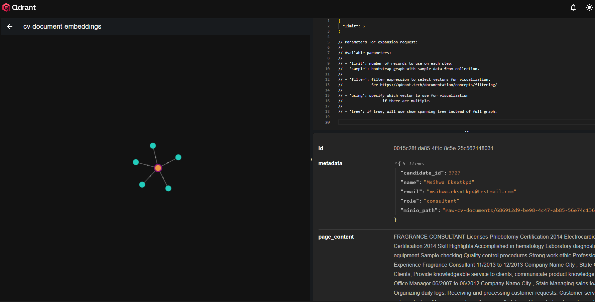

# VectorDatabase-CVAnalyis

## Description
Simple project to test Qdrant vector database locally with Docker in a practical scenario. I am also using miniIO as a storage for CVs,
PostgreSQL as a database for candidate metadata and FastAPI with Langchain to host the backend API and build the Q&A pipeline more easily.

For the embeddings, I decided to use a simple transformer: `sentence-transformers/all-MiniLM-L6-v2`, both its encoder and decoder. The 
embeddings dimension is 384 float16, which could still be narrowed down if needed.

For the Q&A pipeline, since I'm using a vector datastore, following a RAG architecture seems to be in order. However, I also wanted to use 
my local GTX 1660TI for inference, thus I couldn't load a fullsize model given the input embeddings, so I used a `mistralai/Mistral-7B-Instruct-v0.2`
with a 4bit quantization. 

## File structure
The main project code files are in the API folder:
1. `main.py` - REST API built with FastAPI in python
2. `Ingestion module` - holds logic for cv and data submission to upload to all 3 storages
3. `Retrieval module` - holds logic for Langchain Q&A pipeline with Qdrant vector store

The remainder of the files are helpers to create the PostgreSQL table, Qdrant collection and seed the data. Data is not provided, but I 
retrieved it from a resume dataset from Kaggle: [text](https://www.kaggle.com/datasets/snehaanbhawal/resume-dataset?resource=download).

If you decide to use the same dataset, please keep the same folder structure for it.

## Installation
1. Make sure you have a working python environment, version at least `3.10` and pip as module manager installed
2. Make sure you have Docker Desktop installed if you're on Win (or Docker Engine with Docker Daemon if you're on Linux)
3. Verify the `docker-compose.yaml` file to contain all env variables (including the HUGGINGFACE_HUB_TOKEN needed for transformer model download).
4. Run `docker-compose up -d` in a terminal in root folder. Wait for all containers to raise up.
5. Visit the webui interface for each storage on:

   - `MiniIO` - http://http://localhost:9090/ (also creat `raw-cv-documents` bucket via that interface) 
   - `Qdrant` - http://localhost:6333/dashboard/ 
   - `PostgresSQL` - http://localhost:8080/browser/ (you will have to register the database server and then run the create table script)

6. In root check the given Postman collection which contains 2 endpoints. 

    - `POST: http://localhost:8000/upload_cv`
    - `POST: http://localhost:8000/ask`

#### MiniIO interface

#### Qdrant interface

#### PostgreSQL Interface
    
#### Postman Ask Question Endpoint
 

### Additional Note
For the A simple question takes about 25min on a cold start and 10min in general to answer which is very long. This needs to be solved. Adding to the list of improvements, I can 
also create a rudimentary webui interface instead of using tools like Postman, or curl. 
It's more of a PoC / playground app than anything else, since it's the first time I'm working hands on with a vector database.
